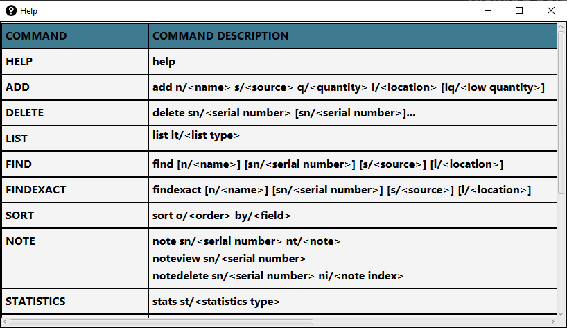
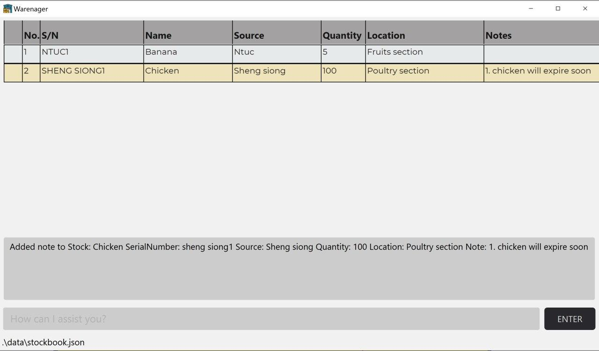
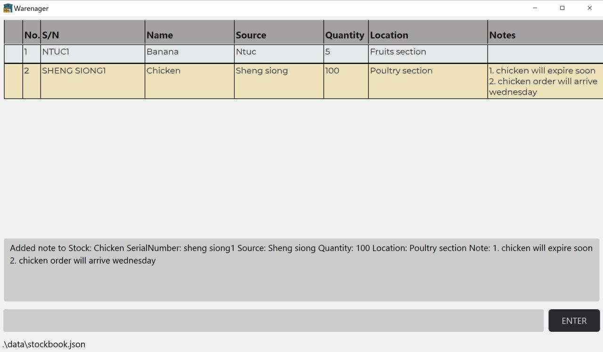
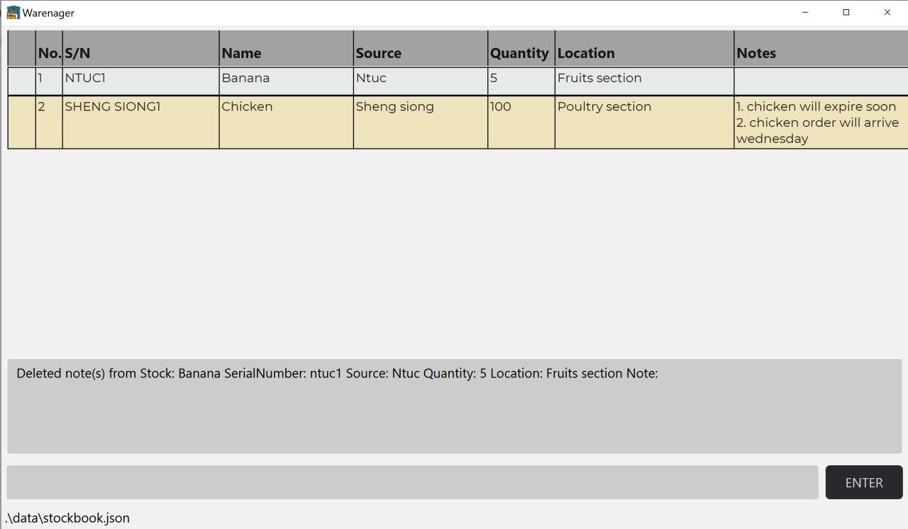
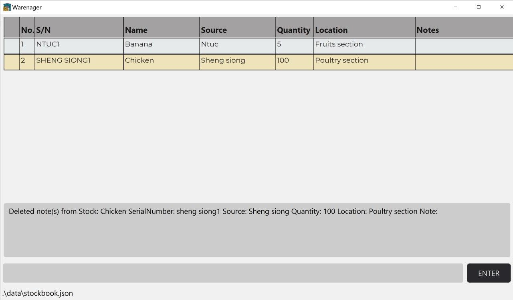
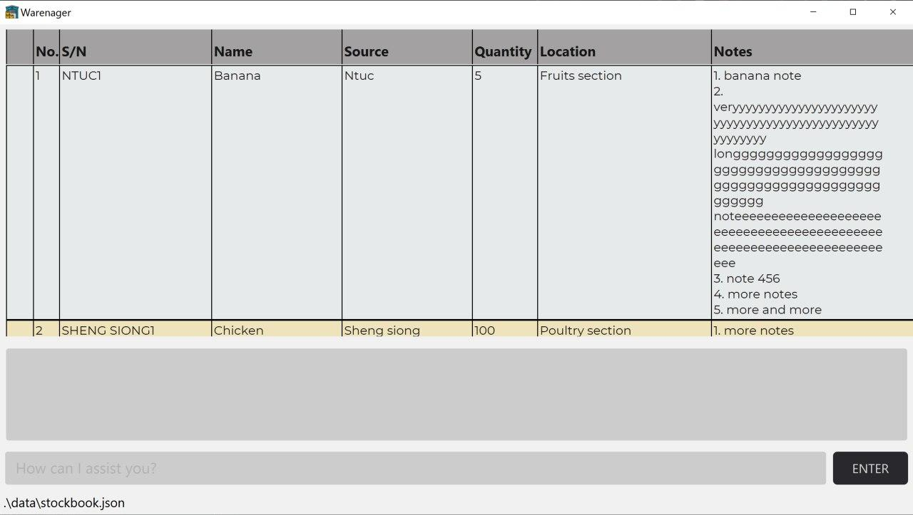
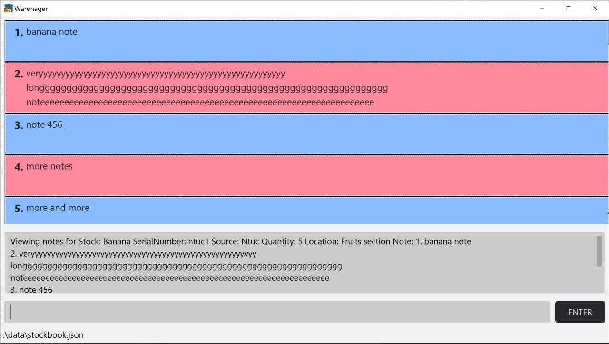
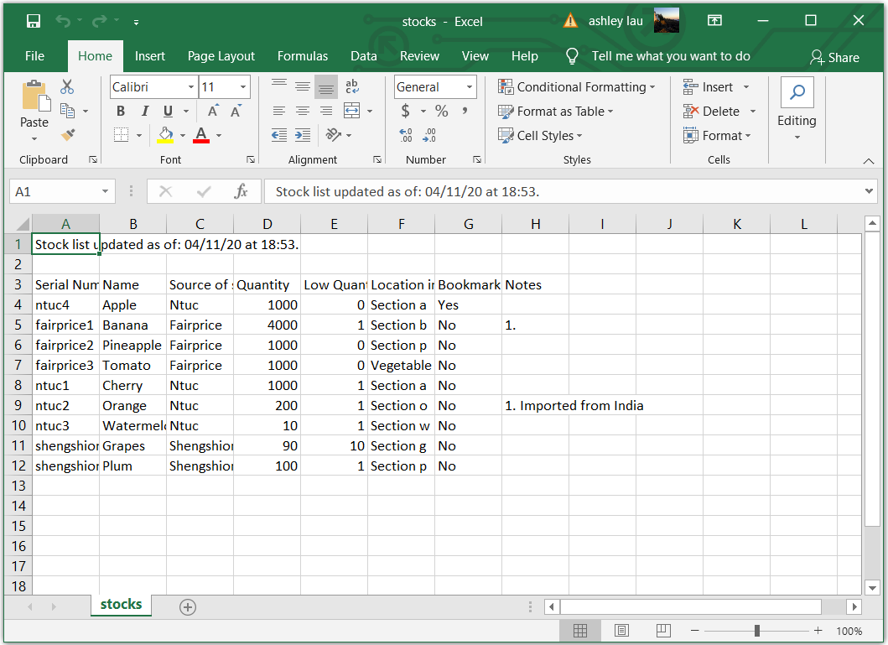

---
<h3>Table of Contents</h3>
* Table of Contents
{:toc}

--------------------------------------------------------------------------------------------------------------------
## Introduction

### Warenager’s User Guide

This user guide introduces our inventory application, Warenager, and provides support
for the usage of its functionalities. For quick reference, we have provided a [summarised table of commands](#command-summary)
and their usage formats
at the end of this guide.

### About Warenager

Warenager is an **inventory application** to help warehouse managers of small scale companies
keep track of items in their warehouse. It **optimizes management tasks** for warehouse managers including but not
exhaustive of updating, searching and sorting via Command Line Interface (CLI).

--------------------------------------------------------------------------------------------------------------------
## Quick start
To get started using Warenager,

1. Ensure you have Java `11` or above installed in your Computer.

1. Download the latest `warenager.jar` from [here](https://github.com/AY2021S1-CS2103T-T15-3/tp/releases).

1. Copy the jar file to the folder you want to use as the _home folder_ for your Warenager.

1. Double-click the jar file to start the app. The commands available in the current version of
   Warenager are: add, delete, update, find, findexact, note, notedelete, stats, sort, print, list and help.

--------------------------------------------------------------------------------------------------------------------
## Definitions

Term | Definition
--------|------------------
**Parameters** | Parameters are additional fields to key in during user input. e.g. `q/<source of stock>`, `n/<name>`
**CSV File** | Comma-separated values File. It contains data separated by commas.

--------------------------------------------------------------------------------------------------------------------
## Labels

Label | Meaning
--------|------------------
**:warning:** | Cautionary advice/Precautions
**:information_source:** | Useful notes/summaries for sections.

--------------------------------------------------------------------------------------------------------------------

## Features

<div markdown="block" class="alert alert-info">

**:information_source: Brief summary of features:**<br>

Note: Stocks possess these fields: Name, Serial Number, Source, Quantity, Location etc. <br>
(These stock details are presented in a drop down window.)

* **Adding** stocks: Unique serial number is generated based on the stock item and source company.
* **Deleting** stocks
* **Updating** stock fields
* **Searching** for stocks by
    * name of stock
    * serial number
    * source of stock
    * location stored in warehouse
* Adding / Deleting **optional notes** to stocks
* Viewing all notes of a stock
* **Bookmarking** stocks: e.g. often used stocks, search bookmark<item>.
* **Print** to generate file for printing of stock list.
* **Storage** into csv and json files.

* Upon start up of the Warenager application, stocks are by default displayed
in order of decreasing priority: low quantity stocks, bookmarked stocks, other stocks
</div>

--------------------------------------------------------------------------------------------------------------------
## Commands

This section provides support for the commands required to perform desired actions on Warenager.
<div markdown="block" class="alert alert-info">

**:information_source: Note for command input format:**<br>

* Words enclosed in `<>` are the input parameters to be supplied by the user. <br>
  For example, in `n/<name>`, `name` is a parameter which can be used as `n/Pork Belly`.

* Prefixes not enclosed with anything is compulsory, must be provided by the user, and duplicate is not allowed. <br>
  For example, in `list lt/<list type>`, the `lt/<list type>` must be provided and no duplicate is allowed. <br>
  `list` and `list lt/all lt/bookmark` are invalid command formats, but `list lt/all` is valid.

* Prefixes enclosed with `[]` is optional, can be omitted by the user, and duplicate is not allowed. <br>
  For example, in `update sn/<serial number> [n/<name]`, the `n/<name>` can be omitted. <br>
  `update sn/Fairprice1 n/Apple` and `update sn/Fairprice1` are both valid command formats, <br>
  but `update sn/Fairprice1 n/Apple n/Banana` is not a valid command format.

* Compulsory prefixes with `...` trailing after them can be used more than one time in one command. <br>
  For example, in `delete sn/<serial number>...`, the `sn/<serial number>` must be provided and duplicates are allowed. <br>
  `delete sn/Fairprice1` and `delete sn/Fairprice1 sn/Ntuc1` are both valid command formats.
  
* Multiple prefixes combined with `|` means only one of them can be provided at a single command. <br>
  For example, in `update sn/<serial number> [iq/<increment value> | nq/<new quantity>]`, at most one of `iq/<increment value>`
  or `nq/<new quantity>` may be provided. <br>
  `update sn/Fairprice iq/+10 nq/100` is an invalid command format, but `update sn/Fairprice1 iq/+10`, 
  `update sn/Fairprice1 nq/100`, `update sn/Fairprice1` are all valid command formats.

* Prefixes given can be in any order. <br>
  For example, `update sn/Fairprice1 n/Apple` and `update n/Apple sn/Fairprice1` are both valid and behave exactly the same.

* All 15 valid prefixes that are used in Warenager are <br>
  `n/<name>, s/<source>, q/<quantity>, lq/<low quantity>, l/<location>, lt/<list type>, sn/<serial number>, nq/<new quantity>,
  iq/<increment value>, nt/<note>, ni/<note index>, st/<statistics type>, by/<field>, o/<order>, fn/<file name>`.

</div>

<div markdown="block" class="alert alert-warning">

**:warning: Warning for invalid prefixes**

Unexpected behaviors might occur if any prefix besides the 15 valid prefixes recognized by Warenager is supplied by the user. <br>
In general, Warenager will not be able to parse any prefix besides the 15 valid prefixes above and will recognize the
invalid prefix as a parameter instead. <br>
For example, in `delete sn/Fairprice1 x/Random`, `Fairprice1 x/Random` will be recognized as the `<serial number>`. 

</div>

### Command summary
Summary of the commands required to perform certain actions is listed in this table:

Action | Format, Examples
--------|------------------
**Add** | `add n/<name> s/<source> q/<quantity> l/<location> [lq/<low quantity>]` <br> e.g. `add n/Banana cake s/Fairprice q/100 l/Food section`
**List** | `list lt/<list type>` <br> e.g. `list lt/bookmark`
**Delete** | `delete sn/<serial number>...` <br> e.g. `delete sn/Fairprice1`
**Find** | `find [n/<name>] [sn/<serial number>] [s/<source>] [l/<location>]` <br> e.g. `find n/banana sn/SHENGSIONG`
**FindExact** | `findexact [n/<name>] [sn/<serial number>] [s/<source>] [l/<location>]` <br> e.g. `findexact n/banana sn/SHENGSIONG`
**Note** | `note sn/<serial number> nt/<note>` <br> e.g. `note sn/shengsiong1 nt/chicken will expire soon`
**NoteDelete** | `notedelete sn/<serial number> ni<note index>` <br> e.g. `notedelete sn/ntuc1 ni/1`
**NoteView** | `noteview sn/<serial number>` <br> e.g. `noteview sn/ntuc1`
**Update** | `update sn/<serial number>... [iq/<increment value> `&#124;` nq/<new quantity>] [n/<name>] [s/<source>] [l/<location>] [lq/<low quantity>]` <br> e.g. `update sn/Ntuc1 iq/+50 n/heineken` 
**Statistics** | `stats st/<statistics type>` <br> e.g. `stats st/source-qd-ntuc`
**Print** | `print fn/<file name>` <br> e.g. `print fn/stocks`
**Sort** | `sort o/<order> by/<field>` <br> e.g. `sort o/descending by/quantity`
**Bookmark** | `bookmark sn/<serial number>...` <br> e.g. `bookmark sn/China3`
**Unbookmark** | `unbookmark sn/<serial number>...` <br> e.g. `unbookmark sn/China3`
**Help** | `help`
**Exit** | `exit`

--------------------------------------------------------------------------------------------------------------------

### Components of Warenager


### Viewing help : `help`

Displays the list of command instructions for features in Warenager and how to use the command.

<h4>Format</h4>

```
help
```

<h4>Expected Help Window</h4>


### Adding new stock: `add`
Adds a new stock into the inventory. A unique serial number for the new stock will be generated by the program.
The optional field low quantity will be set to 0 if not present in the input.

<h4>Format</h4>

```
add n/<name> s/<source> q/<quantity> l/<location> [lq/<low quantity>]
```

<h4>Examples</h4>

```
add n/Banana cake s/Fairprice q/100 l/Food section
add n/Sprite s/Ntuc q/1000 l/Drinks section lq/5000
```

### Listing of stock: `list`
Lists all the stock(s) in the inventory.

<h4>Format</h4>

```
list lt/<list type>
```

<div markdown="block" class="alert alert-info">

**:information_source: The valid list types that can be provided and the respective list that it shows are**

**list type** | **What the list shows**
------| --------
**all** | All the stocks in the inventory.
**bookmark** | All the stocks in the inventory that is bookmarked.
**low** | All the stocks in the inventory that is low in quantity.

</div>

<h4>Examples</h4>

```
list lt/bookmark
```


```
list lt/all
```


### Deleting of stock: `delete`
Deletes the stock(s) using the stock's serial number from the inventory. Multiple stocks can be deleted simultaneously.

<h4>Format</h4>

```
delete sn/<serial number>...
```

<h4>Examples</h4>

```
delete sn/Fairprice1 sn/Ntuc1
```

### Find stocks from inventory: `find`

Displays a list of stocks found in the inventory that contains all keywords
specified in ANY one of fields searched.

<h4>Format</h4> 

```
find [n/<name>] [sn/<serial number>] [s/<source>] [l/<location>]
```

<h4>Search criteria</h4>

* Only stocks that contain all the search keywords for a field will be displayed. <br>
    e.g. `find n/ChickenNuggets` will not match stock with Name: Chick. <br>
    e.g. `find n/ChickenNuggets abcdef` will not match stock with Name: ChickenNuggets. <br>

* Search is case-insensitive.
    e.g. `find n/ashLey` will match stock with Name: Ashley.

* Any stock with any field that contains all the search keywords in any of the fields searched will be displayed.<br>

<h4>Examples</h4>

Stock | Details
------| --------
**Stock 1** | Name: Banana<br> Serial Number: NTUC1111<br> Source: Ntuc<br> Quantity: 5<br> Location in warehouse: Fruits section
**Stock 2** | Name: Chicken<br> Serial Number: SHENGSIONG1111<br> Source: Shengsiong<br> Quantity: 100<br> Location in warehouse: Poultry section

```
find n/banana sn/SHENGSIONG
```
will match both Stock 1 and Stock 2 <br>

```
find l/section
```
will match both Stock 1 and Stock 2. <br>

```
find n/chicken l/poultry
```
will match only Stock 2. <br>

```
find s/ntuc l/singapore
```
will match only Stock 1.

### Find exact stocks from inventory: `findexact`
Displays a list of stocks found in the inventory that contains all keywords specified in ALL fields searched.

<h4>Format</h4>

```
findexact [n/<name>] [sn/<serial number>] [s/<source>] [l/<location>]
```

<h4>Search criteria</h4>
* Only stocks that contain all the search keywords for all fields will be displayed. <br>
    e.g. `findexact n/ChickenNuggets s/ntuc` 
    will not match stock with Name: Chick, Source: ntuc. <br>
    e.g. `findexact n/Chicken sn/1111`
    will match stock with Name: ChickenNuggets, SerialNumber: 1111. <br>
    e.g. `findexact n/ChickenNuggets abcdef l/section b`
    will not match stock with Name: ChickenNuggets, Location: section b.<br>

* Search is case-insensitive.
    e.g. `findexact n/ashLey s/nTuC` will match stock with Name: Ashley, Source: ntuc.

* Any stock with fields containing all the search keywords in all the fields searched will be displayed.<br>

<h4>Examples</h4>

Stock | Details
------| --------
**Stock 1** | Name: Banana<br> Serial Number: NTUC1111<br> Source: Ntuc<br> Quantity: 5<br> Location in warehouse: Fruits section
**Stock 2** | Name: Chicken<br> Serial Number: SHENGSIONG1111<br> Source: Shengsiong<br> Quantity: 100<br> Location in warehouse: Poultry section

```
findexact n/banana sn/SHENGSIONG
```
will not match Stock 1 and Stock 2.<br>

```
findexact l/section
```
will match both Stock 1 and Stock 2. <br>

```
findexact n/chicken l/section
```
will match only Stock 2. <br>

```
findexact n/banana s/ntuc l/singapore
```
will not match Stock 1 and Stock 2.

### Update inventory: `update`
Updates the details of the desired stock(s), requires the serial number of stock(s).

<h4>Format</h4>

```
update sn/<serial number>... [iq/<increment value> | nq/<new quantity>] [n/<name>] [s/<source>] [l/<location>] [lq/<low quantity>]
```

<div markdown="block" class="alert alert-warning">

**:warning: In case one of serial numbers is invalid**
If more than one serial number is passed and at least one of them is wrong (not found in the inventory list), then the command
will not update anything and shows an error message.

</div>

Values to be updated are case-insensitive.

<h4>Examples</h4>

Stock | Details
------| --------
**Stock 1** | Name: Banana<br> Serial Number: NTUC1<br> Source: Ntuc<br> Quantity: 5<br> Location in warehouse: Fruits section
**Stock 2** | Name: Chicken<br> Serial Number: SHENGSIONG1<br> Source: Shengsiong<br> Quantity: 100<br> Location in warehouse: Poultry section
**Stock 3** | Name: Guinness<br> Serial Number: COLDSTORAGE1<br> Source: Coldstorage<br> Quantity: 10<br> Location in warehouse: Drinks section

```
update sn/Ntuc1 n/Apple
```
will change **Stock 1** name to `Apple`.

```
update sn/Shengsiong1 s/Coldstorage l/Meat section
```
will change **Stock 2** source to `Coldstorage` and location to `Meat section`.

```
update sn/Ntuc1 iq/+50 n/heineken
```
will change **Stock 3** name to `heineken` and increment the quantity by `50`. **Stock 3** quantity changes to `60`.

```
update sn/Shengsiong1 s/Coldstorage nq/50 lq/60
```
will change **Stock 2** source to `Coldstorage`, quantity to `50`, and low quantity threshold to `60` and therefore flagging the stock because `50 < 60`.

```
update sn/Ntuc1 sn/Coldstorage1 n/Apple juice
```
will change **Stock 1** and **Stock 3** name to `Apple juice`.

### Adding notes to stock: `note`
Adds a note to the stock specified, displayed in the notes column for that stock.
Multiple notes can be added to the stock and each note will be indexed. <br>

<div markdown="block" class="alert alert-warning">

**:warning:**
If notes are too long to be fully displayed in the notes column, ellipsis will be displayed in place of overrun.
To view full notes for the stock, use the `noteview` command.

</div>

<h4>Format</h4>
```
note sn/<serial number> nt/<note>
```

<h4>Examples</h4>

Stock | Details
------| --------
**Stock 1** | Name: Banana<br> Serial Number: NTUC1<br> Source: Ntuc<br> Quantity: 5<br> Location in warehouse: Fruits section
**Stock 2** | Name: Chicken<br> Serial Number: SHENGSIONG1<br> Source: Shengsiong<br> Quantity: 100<br> Location in warehouse: Poultry section

```
note sn/sheng siong1 nt/chicken will expire soon
```
will add note with index 1 in note column for Stock 2. <br>



```
note sn/sheng siong1 nt/chicken order will arrive wednesday
```
will add note with index 2 for Stock 2. <br>



```
note sn/ntuc1 nt/banana just arrived
```
will add note with index 1 in note column for Stock 1. <br>


### Deleting note(s) from stock: `notedelete`
Deletes a note, specified by the note's index, from the stock specified by its serial number.

<div markdown="block" class="alert alert-warning">

**:warning:**
Note index must be an integer.
To delete ALL notes from a stock, note index to specify is 0.

</div>

<h4>Format</h4>

```
notedelete sn/<serial number> ni/<note index>
```

<h4>Examples</h4>

* Before: <br>


* After command:
```
notedelete sn/ntuc1 ni/1
```



* After command
```
notedelete sn/sheng siong1 ni/0
```



### Viewing all notes of a stock: `noteview`
Views all notes of the stock specified by its serial number.

<h4>Format</h4>

```
noteview sn/<serial number>
```

<h4>Examples</h4>

* Before: <br>



* After command
```
noteview sn/ntuc1
```



### Generating statistics: `stats`
Generates a statistical view in a pie chart depicting the target fields.

<h4>Format</h4>

```
stats st/<statistics type>
```

<div markdown="block" class="alert alert-info">

**:information_source: The valid statistics types that can be provided and what the respective statistics describes are**

**Statistics type** | **What the statistics describes**
------| --------
**source** | Distribution of source companies.
**source-qd-<source company>** | Distribution of stocks for the target source company.

</div>

<h4>Examples</h4>

```
stats st/source
```


```
stats st/source-qd-abc
```
(`abc` exists with the shown items) <br>


### Bookmarking stocks in the list: `bookmark`
Bookmarks the desired stock(s). 
Bookmarking a stock pushes the stock to the top of the stock list.

<h4>Format</h4>

```
bookmark sn/<serial number>...
```

<h4>Examples</h4>

```
bookmark sn/China3
```


### Unbookmarking stocks in the list: `unbookmark`
Removes bookmark from the desired stock(s).

<h4>Format</h4>

```
unbookmark sn/<serial number>...
```

<h4>Examples</h4>

```
unbookmark sn/China3
```


### Sorting inventory: `sort`
Sort the inventory by a specific field and order.

<h4>Format</h4>

```
sort o/<order> by/<field>
```

<div markdown="block" class="alert alert-info">

**:information_source: Regarding order and field to be sorted** 

* The order can only be one of the following:
    1. `ascending` - sorts the inventory in ascending order
    2. `descending` - sorts the inventory in descending order
    
* The field can only be one of the following:
    1. `name` - sorts the inventory by name
    2. `source` - sorts the inventory by source
    3. `quantity` - sorts the inventory by quantity
    4. `location` - sorts the inventory by location
    5. `serialnumber` - sorts the inventory by serial number

</div>

<h4>Examples</h4>

Stock | Details
------| --------
**Stock 1** | Name: Chicken breast<br> Serial Number: FAIRPRICE1<br> Quantity: 10<br> Source: Fairprice<br> Location in warehouse: Poultry section
**Stock 2** | Name: Pork belly<br> Serial Number: FAIRPRICE2<br> Quantity: 25<br> Source: Fairprice<br> Location in warehouse: Poultry section
**Stock 3** | Name: Coca cola<br> Serial Number: NTUC1<br> Quantity: 100<br> Source: Ntuc<br> Location in warehouse: Drinks section
**Stock 4** | Name: Sprite<br> Serial Number: NTUC2<br> Quantity: 100<br> Source: Ntuc<br> Location in warehouse: Drinks section

```
sort o/descending by/quantity
```
will sort based on quantity and in descending order. <br>


```
sort o/ascending by/name
```
will sort based on name and in ascending order. <br>


### Command Suggestion
Sometimes user will type in wrong commands. Warenager will help such user by suggesting the correct format
of the command if the command word is valid. If the command word is invalid, then Warenager will try to predict
and suggest the closest command to whatever the user has typed.

<div markdown="block" class="alert alert-warning">

**:warning:**
The suggestion will only be made if the command format is invalid or unknown. If the command is valid, but there
are errors such as serial number not found, then Warenager will not suggest anything to the user and instead displays
an error message.

</div>

<h4>Examples</h4>

```
del
```
Warenager will suggest:
```
delete sn/<serial number>
```

```
delt sn/NUS1
```
Warenager will suggest:
```
delete sn/NUS1
```

```
ad n/Thai Tea s/Fairprice q/100
```
Warenager will suggest: 
```
add n/Thai Tea s/Fairprice q/100 l/<location>
```

```
list n/Duck q/100
```
Warenager will suggest: 
```
list lt/all
```

### Generates a csv file that contains all stocks: `print`
Generates a csv file that contains all stocks. Csv file will be named according to the user input, and the file name
can only contain alphanumeric characters. Users may want to sort the stocks using `sort` command
to sort the stock in their preferred order before converting it into the csv file. The csv file is saved
to `[root directory]/data/userInput.csv` after successfully executing the command.

<h4>Format</h4>

```
print fn/<file name>
```

<h4>Examples</h4>


```
print fn/stocks
```
After executing the command, proceed to the folder which contains Warenager. Click on the `data`
folder circled in red.


 
Open `stocks.csv` folder circled in red with excel.


The stocks in your inventory will be listed according the to format shown below. The file also includes
the latest update time for the `stocks.csv`.



### Saving data
Data (all stocks in inventory in json) is automatically saved to
`[root directory]/data/stockbook.json` when any of these commands is executed:
* add
* delete
* note
* update

The set of used serial number sources is automatically saved to
`[root directory]/data/serialnumbers.json` when any of these commands is executed:
* add

### Exiting Warenager: `exit`
Terminates the program.

<h4>Format</h4>

```
exit
```

--------------------------------------------------------------------------------------------------------------------
## FAQ

**Q**: Can I use Warenager on any OS?<br>
**A**: Yes. Warenager is supported by Windows, Mac and Linux.

**Q**: Can I use Warenager on another device?<br>
**A**: Yes. Simply transfer the data files under `/data` and copy over to the same directory `/data` in the Warenager of your
other device.

--------------------------------------------------------------------------------------------------------------------
